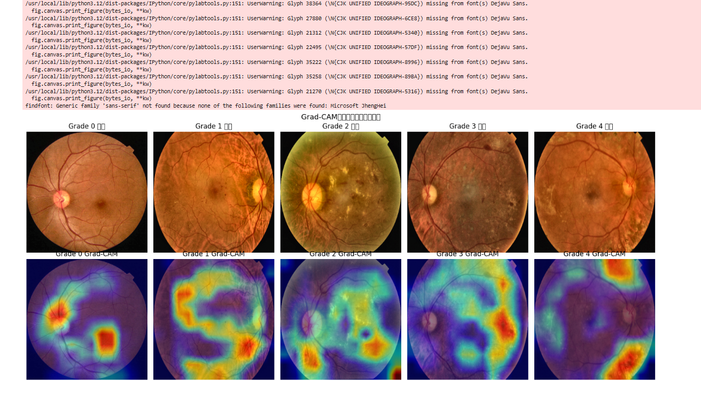
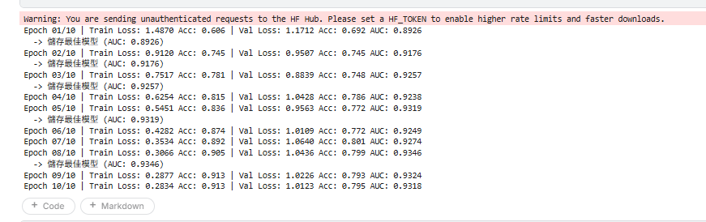
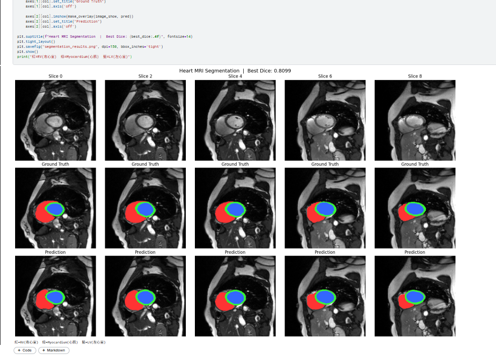
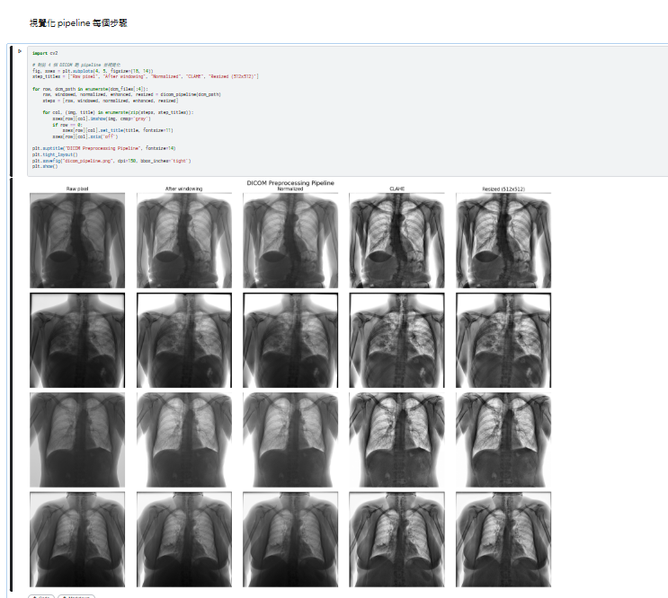

# Medical AI Portfolio

以下三個專案為應徵醫療 AI 工程師職缺所製作，涵蓋影像分類、器官分割、DICOM 前處理三大核心能力。

---

## 1. Fundus Diabetic Retinopathy Classification

使用 EfficientNet-B3 對視網膜 Fundus 影像進行糖尿病視網膜病變分級（0–4 級）。

**技術：** Python · PyTorch · EfficientNet-B3 · OpenCV · Grad-CAM

**重點：**
- 資料集：APTOS 2019（3,662 張影像，5 分類）
- 影像前處理：去黑邊裁切 + CLAHE 對比增強
- 類別不均衡處理：class weight 策略
- 可解釋性：Grad-CAM 熱力圖視覺化模型關注區域

| Metric | Score |
|--------|-------|
| Best AUC (OvR) | 0.9346 |
| Val Accuracy | 79.9% |

---

---
🔗 [Kaggle Notebook](https://www.kaggle.com/code/michelle0417/fundus-diabetic-retinopathy-classification)

---

## 2. Cardiac MRI Multi-Structure Segmentation

使用 U-Net 對心臟 MRI 影像進行三結構自動分割。

**技術：** Python · PyTorch · MONAI · U-Net · HDF5

**重點：**
- 資料集：ACDC（200 名病人心臟 MRI）
- 分割目標：右心室（RV）、心肌（Myocardium）、左心室（LV）
- 損失函數：Dice Loss（解決前景/背景不均衡）
- 結果視覺化：5 張連續切片 Ground Truth vs Prediction 對比

| Metric | Score |
|--------|-------|
| Best Dice Score | 0.8099 |

---

---
🔗 [Kaggle Notebook](https://www.kaggle.com/code/michelle0417/ct-x-ray-organ-segmentation-heart)

---

## 3. DICOM Preprocessing Pipeline

針對真實醫療影像格式設計的完整前處理流程。

**技術：** Python · pydicom · SimpleITK · OpenCV · CLAHE

**Pipeline 步驟：**
1. 讀取 DICOM 並提取 metadata（病人資訊、像素間距、Modality）
2. 套用 RescaleSlope / RescaleIntercept（HU 值轉換）
3. 視窗化（Window/Level）
4. 正規化到 0–255
5. CLAHE 對比增強
6. 縮放到固定尺寸（512×512）

---

---

🔗 [Kaggle Notebook](https://www.kaggle.com/code/michelle0417/dicom-preprocessing-pipeline)

---

## Tech Stack

